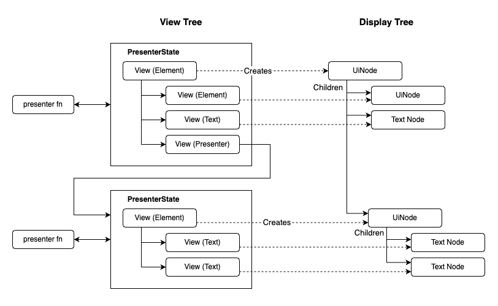

# Quill

**Quill** is a UI framework for the Bevy game engine. It's meant to provide a simple API for
constructing reactive user interfaces, similar to frameworks like React and Solid, but built on a
foundation of Bevy ECS state management.

Quill is an experimental library which borrows ideas from a number of popular UI frameworks,
including React.js, Solid.js, Dioxus, and Xilem. However, the way these ideas are implemented is
quite different, owing to the need to build on the foundations of Bevy ECS.

At this point in time, Quill is meant to be more of a research platform - a "proof of concept" -
than a usable library. This means that nothing is set in stone yet.

## Getting started

For now, you can run the examples. The "complex" example shows off multiple features of the
library:

```sh
cargo run --example complex
```

## Aspirations / guiding principles:

* Allows easy composition and re-use of hierarchical widgets.
* Built on top of existing Bevy UI components.
* No special syntax required, it's just Rust.
* Allows reactive hooks such as `use_resource()` that hook into Bevy's change detection framework.
* State management built on top of Bevy ECS, rather than maintaining its own separate UI "world".
* Any data type (String, int, color, etc.) can be displayed in the UI so long as it implements
  the `View` trait.
* Efficient rendering approach with minimal memory allocations. Uses a hybrid approach that borrows
  from both React and Solid to handle incremental modifications of the UI node graph.
* Supports CSS-like styling and dynamic visuals.

Check out the demo video [here](https://youtu.be/NXabt3NrKMg).

## Examples usages

### A basic UI widget

The only requirements on a presenter is that it take a `Cx` context as its first argument, and return an `impl View` as its result.

```rust
// A presenter function
fn counter(mut cx: Cx<u8>) -> impl View {
    // Access data in a resource
    let counter = cx.use_resource::<Counter>();
    Element::new().children((
        format!("The count is: {}", counter.count),
    ))
}
```

### Conditional rendering with `If`

The `If` view takes a conditional expression, and two child views, one which is rendered when the condition is true, the other when the condition is false.

```rust
fn counter(mut cx: Cx<u8>) -> impl View {
    let counter = cx.use_resource::<Counter>();
    Element::new().children((
        "The count is: ",
        If::new(counter.count & 1 == 0, "even", "odd"),
    ))
}
```

### Rendering multiple items with `For`

`For::each()` takes a list of items, and a callback which renders a `View` for each item:

```rust
fn event_log(mut cx: Cx) -> impl View {
    let log = cx.use_resource::<ClickLog>();
    Element::new()
        .children(For::each(&log.0, |item| {
            Element::new()
                .styled(STYLE_LOG_ENTRY.clone())
                .children((item.to_owned(), "00:00:00"))
        })),
}
```

There is also `For::index()` and `For::keyed()`.

### Invoking child presenters

If a presenter takes no properties, then you can just use the name of the function directly.

For presenters which take properties, most of the time this will be a struct - but it doesn't have to be. Use the `.bind()` method to associate
a presenter with a set of property values.

```rust
fn root_presenter(mut _cx: Cx) -> impl View {
    Element::new().children((no_args, with_args.bind("Fred")))
}

fn no_args(mut cx: Cx) -> impl View {
    "I have no args"
}

fn with_args(mut cx: Cx<&str>) -> impl View {
    format!("I have one arg: {}", cx.props.name)
}
```

### Modifying the generated UI nodes

The `.with()` method takes a callback which allows you to directly modify the Bevy UI node:

```rust
fn event_log(mut cx: Cx) -> impl View {
    let log = cx.use_resource::<ClickLog>();
    Element::new()
        .with(|entity, world| {
            // Do stuff with the entity
        })),
}
```

`.with()` is called whenever the view is updated. If you only need to modify the element when it is first created, use `.once()`.

There's also a shortcut method that lets you insert an ECS component:

```rust
Element::new().insert(ViewportInsetElement {}),
```

### Returning multiple nodes

Normally a `View` renders a single UI node. If you want to return multiple nodes, use a `Fragment`:

```rust
fn multi(mut cx: Cx) -> impl View {
    Fragment::new((
        "Hello, ",
        "World!"
    ))
}
```
The children of the `Fragment` will be inserted inline in place of the `Fragment` node.

### Local state

You can declare a local state variable with `cx.use_local()`. The argument is a closure which returns the initial value. The result is an object which has `.get()` and `.set()` methods. `use_local()` produces a reactive data source, which means that whenever the value is changed, it will trigger a re-render of the presenter.

```rust
fn local_test(mut cx: Cx<&str>) -> impl View {
    let name = *cx.props;
    let counter = cx.use_local::<i32>(|| 0);
    Element::new()
        .children((
            format!("The count is: {}: {}", name, counter.get()),
        ))
        .once(move |entity, world| {
            // Increment the counter when we click
            let mut e = world.entity_mut(entity);
            let mut counter = counter.clone();
            e.insert(On::<Pointer<Click>>::run(
                move |_ev: Res<ListenerInput<Pointer<Click>>>| {
                    counter.set(counter.get() + 1);
                },
            ));
        })
}
```

### Styling

Here's an example of a widget which changes its border color when hovered:

```rust
use bevy::{prelude::*, ui};
use bevy_quill::prelude::*;
use static_init::dynamic;

#[dynamic]
static STYLE_HOVERABLE: StyleHandle = StyleHandle::build(|ss| {
    ss.border_color("#383838")
        .border(1)
        .selector(":hover", |ss| {
            ss.border_color("#444")
        })
});

pub fn hoverable(cx: Cx) -> impl View {
    Element::new()
        .styled(STYLE_HOVERABLE.clone())
        .children(cx.props.children.clone())
}
```

An element can have multiple styles. Styles are applied in order, first-come, first-serve - there is no CSS "cascade".

Conditional styles can be added via selectors. It supports a limited subset of CSS syntax (basically the parts of CSS that don't require backtracking):

* `:hover`
* `.classname`
* `>` (parent combinator, e.g. `:hover > &`
* `&` (current element)
* ',' (logical-or)

Note that selectors only support styling the *current* node - that is, the node that the style handle is attached to. Selectors can't affect child nodes - they need to have their own styles.

So for example, `".bg:hover > &"` is a valid selector expression, but `"&:hover > .bg"` is not valid. The `&` must always be on the last term. The reason for this is performance - Quill only supports those features of CSS that are lightning-fast.

## Architecture and Rendering Lifecycle

A Quill UI is made up of individual elements called `Views`. If you are familiar with web frameworks
like React.js, Solid.js or Vue, you'll recognizes that Quill views are like "components" or
"widgets": modular, resable elements that are arranged hierarchically. However, `Views` are not the
same as Bevy UI nodes; instead `Views` are templates which produce UI nodes.

Views fall into two categories: built-in views, like `Element`, and user-created views. User-created
views are created by user functions written in Rust, which are called "presenters".

> [!NOTE]
> Note: The name "presenter" has nothing to do with the "Model/View/Presenter" design pattern. (Well,
> almost nothing.)

Presenter functions can depend on external data sources such as resources or state variables.
When these data sources are updated, the presenter function is run again, generating a new `View`.
The `View`, in turn, creates or modifies the Bevy UI nodes that make up the actual UI. Most of the
time, the Bevy UI nodes will be modified in place rather than being generated anew.

Here's an example of a basic presenter which creates an element with two children:

```rust
fn hello_world(mut cx: Cx) -> impl View {
    // `Element` is a generic UI node, kind of like an HTML "div".
    Element::new()
        .children((
            "Hello, ", // Yes, raw string slices implement `View` too!
            Element::new("World!"),
        ))
}
```

This examples shows a presenter function which returns a built-in `Element` view. It also
has two children, one of which is another `Element`, and one which is a string slice (`&str`).
Because Strings and string slices implement `View` they can be used anywhere a view can be.

When a UI is no longer needed (such as when a dialog or menu is closed), the view is *razed*
(the opposite of built), causing the various UI entities to be despawned.

The next sections describe this process in more detail.

### Display Trees and View Trees

The **display tree** is the tree of Bevy Ui Node entities. These are the nodes which actually
produce rendering commands which are sent to the GPU. In Quill, the display tree is analogous
to the HTML DOM: it's the output of a `View`.

The **view tree** is the tree of `View`s that generate the display tree. `View`s are trait
objects that know how to build and patch the display tree. Views contain a number of methods
for mantaining the display tree:

* `.build()` - initializes the nodes of the display graph.
* `.update()` - react to changes in the environment by modifying the nodes of the display graph.
* `.assemble()` - link together the nodes of the display graph in parent/child relationships.
* `.raze()` - disconnect and despawn any nodes generated by this view.

The display tree and view tree have similar hierarchical structure, but they are not the same.
Most view nodes generate a single display node, and most view nodes with children will generate
a display node with the same number of children. However, there are exeptions: A `For` node
will generate multiple children depending on the length of the array used as input, and conditional
nodes will generate a single child out of multiple possible options.

As an example, an `If` node has a true branch and a false branch, but only one branch can be built
at a time. When the conditional expression changes from `true` to `false`, the children generated
by the true branch are razed, and in their place the children generated by the false branch are
built.

The view tree is really a "tree of trees": that is, there is a larger tree whose nodes are made up
of `PresenterState`s, and each of those `PresenterState` nodes contains a tree of all the `Views`
generated by that presenter function. If a presenter calls another presenter, then the `View` nodes
of the parent `PresenterState` will contain links to the child `PresenterState`.

`PresenterState`s are what subscribes to reactive data sources and are the "unit of update
granularity"; it is not possible to update individual `View`s in isolation, instead the
entire `PresenterState` is updated together, with all of the `View`s within it. (This is closer
to the way React works than Solid does.) A `PresenterState` contains everything needed to
regenerate the views, which means that they can be updated in isolation, even if they are leaf
nodes or interior nodes of the view graph.

This diagram shows the relationship between presenters, `PresenterStates`, `Views`, and display nodes:



For those who are familiar with React, built-in views correspond to "intrinsic" types such as
`<div>` or `<button>`, whereas presenter functions correspond to function components such as
`<MyComponent>`. However, the convention of using upper-case/lower-case is reversed here: Built-in
views generally start with an upper-case letter (because they are Rust structs), whereas presenters
start with a lower-case letter (because they are Rust functions).

### Managing State

`View`s are stateless and immutable: each rendering cycle, a new `View` tree is constructed.
However, this is actually very cheap, because the output of a single presenter is not a tree of
allocated/boxed nodes in memory, but a set of nested tuples - in other words, it's a single
object stored in continguous memory.

Because `View`s are stateless, their state must be managed externally. Each `View` has an associated
type, `View::State` which defines the type of the view's state. For most views, the `State` not only
includes the state for itself, but the state for all child views as well. This means that the state
object, like the view object, is a set of nested tuples stored in a single contiguous memory
region. This is only true, however, for views that have a fixed number of children; for views
that have dynamic children, the view states are stored in a `Vec`.

View states, like `View`s, are also stored in the `PresenterState`, however unlike the view tree the
state is mutable. The `.build()` and `.update()` methods are responsible for updating the state at
the same time as it generates the display tree nodes. `PresenterStates` also keep a copy of the
parameters that were passed to the presenter function, and a copy of the last output.

`PresenterState`s are in turn stored inside an ECS component called a `ViewHandle`. The
`PresenterState` is type-erased (via `AnyPresenterState`). Thus, to maintain a reference to
the root of a UI, one only needs to keep track of the `ViewHandle` entity. You can have multiple
`ViewHandle`s for multiple independent UI displays.

Here's how to create a UI, given a root presenter:

```rust
commands.spawn(ViewHandle::new(ui_main, ()));
```

### Reactivity

"Reactive programming" is a development paradigm in which echews explicit subscribing and
unsubscribing from event sources. Instead the mere act of accessing data creates a dependency on it.
This dependency causes the using code to be re-run when the data changes. An easy analogy to
understanding this concept is a spreadsheet cell: when a formula has a reference to cells A1
and B2, the spreadsheet's internal engine knows when that cell needs to be updated (whenever A1
or B2 changes), there's no need to explicitly subscribe to them.

During rendering, presenters can invoke "reactive" functions such as `use_resource()`. These
functions do two things: First, they return the data that was requested, such as a resource.
Secondly, they add a "tracking" component to the `ViewHandle` entity that indicates that the
`ViewHandle` and it's presenter has a dependency on that data, so that when that data changes,
the `ViewHandle` is re-rendered.

Quill contains an ECS system which queries these tracking components and re-renders the views which
are out of date. Note that tracking components are always cleared before calling the presenter,
because the presenter is expected to re-subscribe to its dependencies as a side-effect of execution.
This is how reactive frameworks like React and Solid work, and it's how we can get away with
not having to explicitly unsubscribe from our dependencies.

### Memoization

`PresenterState` nodes are automatically memoized. This means that unless there is a change
to a dependency, or the props passed to the presenter change, then the presenter will not be
called again, the views will not be rebuilt, and the output display nodes will be the same as
from the previous render cycle.

A parent presenter can be re-rendered without re-rendering its children; similarly a child
presenter can be re-rendered without re-rendering its parent. If, however, the child node
produces a different entity than it did on the previous run, then the parent's display tree
will be updated to splice in the new child entity (this is what `.assemble()` does.).

Presenter props changes are detected by comparing the old prop values with the new. This means
that all props must implement `PartialEq`.

### Deep Dive: For-loops

`For` views are views that, given an array of data items, render a variable number of children.
There are three different flavors of `For` loops. The simplest, and least efficient, is the
`index()` loop. This loop simply renders each item at its index position in the array. The reason
this is inefficient is that the array may have insertions and deletions since the previous render
cycle. Thus, if element #2 becomes element #3, then the for loop will just blindly overwrite any
existing display nodes at position #3, destroying any nodes that don't match and building new
nodes in their place.

The next type is `.keyed()`, which is a bit smarter: it takes an additional function closure which
produces a unique key for each array element. The keys can be any data type, so long as they are
clonable and equals-comparable. The algorithm then attempts to match the old array nodes with the
new ones using an LCS (Longest Common Substring) matching algorithm. This means that as array
elements shift around, it will re-use the display nodes from the previous render, minimizing the
amount of churn. Any insertions or deletions will be detected, and the nodes in those positions
built or razed as appropriate.

Finally, there is `.each()`, which treats the actual array data as the key. This doesn't require
the extra closure argument, but requires that your array data implement `Clone` and `PartialEq`.

## Complex example

```rust
/// Define some styles as immutable static
#[dynamic]
static STYLE_MAIN: StyleHandle = StyleHandle::build::build(|ss| ss
    .position(ui::PositionType::Absolute)
    .left(10.)
    .top(10.)
    .bottom(20.)
    .right(10.)
    .border(1)
    .border_color("#888")
    .display(ui::Display::Flex));

#[dynamic]
static STYLE_ASIDE: StyleHandle = StyleHandle::build(|ss| ss
    .background_color("#222")
    .display(ui::Display::Flex)
    .flex_direction(ui::FlexDirection::Column)
    .width(200));

/// Function to set up the view root
fn setup_view_root(mut commands: Commands) {
    commands.spawn(ViewHandle::new(ui_main, ()));
}

/// Top-level presenter
fn ui_main(mut cx: Cx) -> impl View {
    let counter = cx.use_resource::<Counter>();
    // Render an element with children
    Element::new()
        .styled(STYLE_MAIN.clone())
        .children((
            Element::new(()).styled(STYLE_ASIDE.clone()),
            v_splitter,
            // A conditional element
            If::new(
                counter.count & 1 == 0,
                // Strings and string slices also implement `View`.
                "even",
                "odd",
            ),
        ))
}

/// A presenter function
fn v_splitter(mut _cx: Cx) -> impl View {
    Element::new()
        .styled(STYLE_VSPLITTER.clone())
        .children(
            Element::new().styled(STYLE_VSPLITTER_INNER.clone()))
}

```
# Styling

Quill supports CSS-like styling in the form of `StyleHandle`s. A `StyleHandle` is a sharable object
that contains a number of style properties like `background_color`, `flex_direction` and so on.
`StyleHandle`s can be composed - that is, multiple `StyleHandle`s can be applied to the same element,
and the resulting style is computed by merging all the style properties together. There is no
"cascade" as in CSS, styles are applied in the order they are declared.

`StyleHandle` internally contain an  `Arc` because they are designed to be shared. Most styles are
global constants, but nothing prevents you from creating a style dynamically in your presenter function.

Styles are applied to an element using the `.styled()` method, which accepts either a single style,
or a tuple of styles.

`StyleHandle`s are typically creating using the `.build()` method, which accepts a closure that takes
a builder object. The builder methods are flexible in the type of arguments they accept: for
example, methods such as `.margin_right()` and `.row_gap()` accept an `impl Length`, which can be
an integer (i32), a float (f32), or a Bevy `ui::Val` object. In the case where no unit is specified,
pixels is the default unit, so for example `.border(2)` specifies a border width of 2 pixels.

**Coming Soon**: CSS variables.

# Design Notes

Any object can implement `View`. For example, there are implementations of `View` for both
`String` and `&str`, which means that ordinary strings can be used as child nodes without the
need to wrap them in a special "text" element.

Even though the view state graph is frequently reconstructed, it's "shape" is relatively stable,
unlike the display graph. For example, a `For` element may generate varying numbers of children
in the display graph, but each new iteration of the view state graph will have a `For` node in
the same relative location.

A helper class which is used by views is `NodeSpan`, which is kind of like a "rope" for Bevy
Entities. The `.build()` method of each `View` produces exactly one `NodeSpan`, however that span
may contain zero, one, or a varying number of entities that represent child nodes in the display
tree. `NodeSpan`s are also stored along with the view State in ECS components. This list of entities
is flattened before it is attached to the parent entity.

To illustrate how this works, consider the following example: Say a presenter produces a sequence
of three elements, where the second element is a "For" element. This means that the output of
`.build()` will produce three `NodeSpans`, but the middle `NodeSpan` will contain a varying number
of entities based on the data passed to the `For`. For a list of n items passed to `For`, the total
number of entities for the presenter will be n + 2. As the for loop reacts to changes in the length
of the array, it will always know where in the flat list of entities those changes will go.

# Bibliography

* [Xilem: an architecture for UI in Rust](https://raphlinus.github.io/rust/gui/2022/05/07/ui-architecture.html)
* [Building a reactive library from scratch](https://dev.to/ryansolid/building-a-reactive-library-from-scratch-1i0p)
